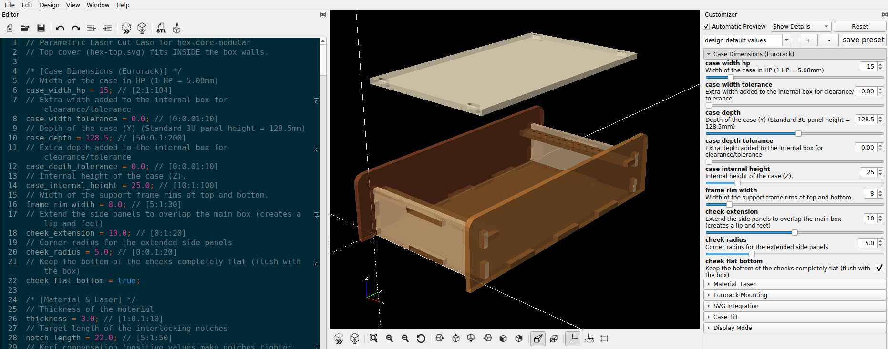
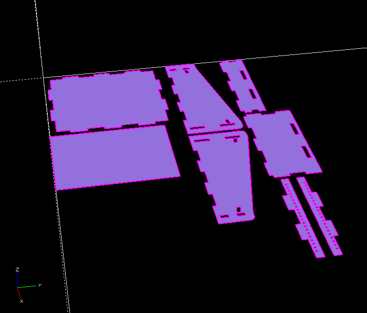
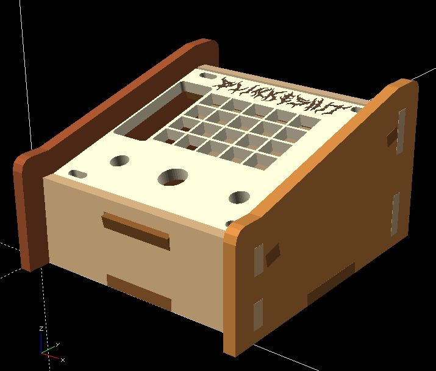
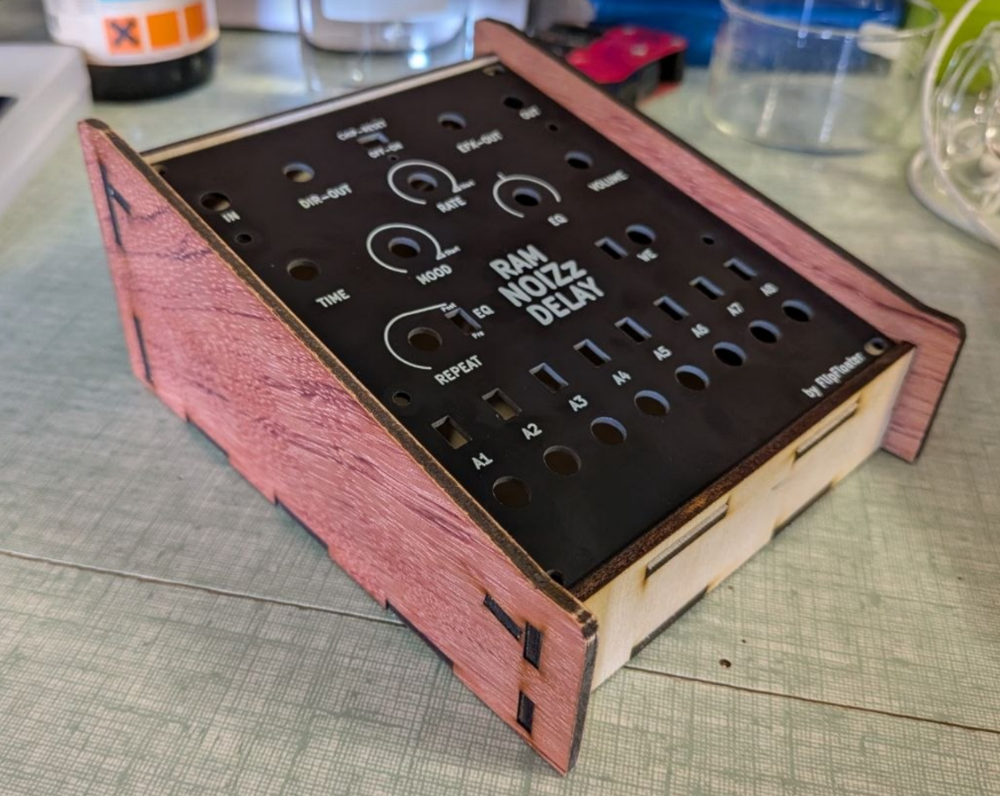

# eurorack2chistli

The eurocrack2chistli OpenSCAD file generates a parametric laser-cut case for Eurorack modules. It features adjustable HP width, depth, material thickness, kerf, and tilt angle. It integrates SVG files for top panel cutouts/engravings and outputs either a 3D assembly for preview or a flat 2D layout for laser cutting.

## Images

## Available Parameters

The design is highly customizable through OpenSCAD's interface. The key parameter categories are:

*   **Case Dimensions**: 
    *   `case_width_hp`: Set the width of the case in standard Eurorack HP (1 HP = 5.08mm).
    *   `case_depth`: The depth of the case (standard 3U panel height).
    *   `case_internal_height`: The internal vertical clearance for components.
    *   `cheek_extension` & `cheek_radius`: Extend the side panels to overlap the main box (creating feet) and adjust their corner radii.
*   **Material & Laser**:
    *   `thickness`: Thickness of the material you are laser cutting (e.g., 3.0mm).
    *   `kerf`: Adjust for the laser cutter's beam width to ensure tight-fitting interlocking joints.
*   **Eurorack Mounting**:
    *   Enable standard Eurorack mounting holes on the top and bottom rails, and customize their diameter (`eurorack_hole_dia`) and margins.
*   **SVG Integration**:
    *   Import custom SVGs for the top panel's border, cutouts/holes, and engraving details.
*   **Case Tilt**:
    *   `panel_tilt`: Angle the top panel towards the user (0 to 45 degrees).
*   **Display Mode**:
    *   `part_to_show`: Switch between a full 3D `assembly` view for visualization, and a flat 2D `layout` view for laser cutter exporting. You can also view individual panels.

## How to use the Customizer in OpenSCAD

1.  Download and install [OpenSCAD](https://openscad.org/).
2.  Open the `eurocrack2chistli.scad` file in OpenSCAD.
3.  Ensure the **Customizer** pane is visible on the right side. If it's not visible, go to the top menu and select **Window -> Customizer**.
4.  In the Customizer pane, you will see all the parameters organized into expandable categories (e.g., Case Dimensions, Material & Laser, etc.).
5.  Adjust the sliders, dropdowns, or text boxes for the parameters you wish to change. The 3D preview window will update automatically (or press `F5` to force a preview refresh).
6.  **To export for laser cutting:**
    *   In the Customizer under the **Display Mode** section, change the `part_to_show` dropdown from `assembly` to `layout`.
    *   Press **F6** to fully Render the 2D geometry (this may take a moment).
    *   Once rendering is complete, go to the top menu and select **File -> Export -> Export as SVG...** (or DXF) to save the cutting file.
